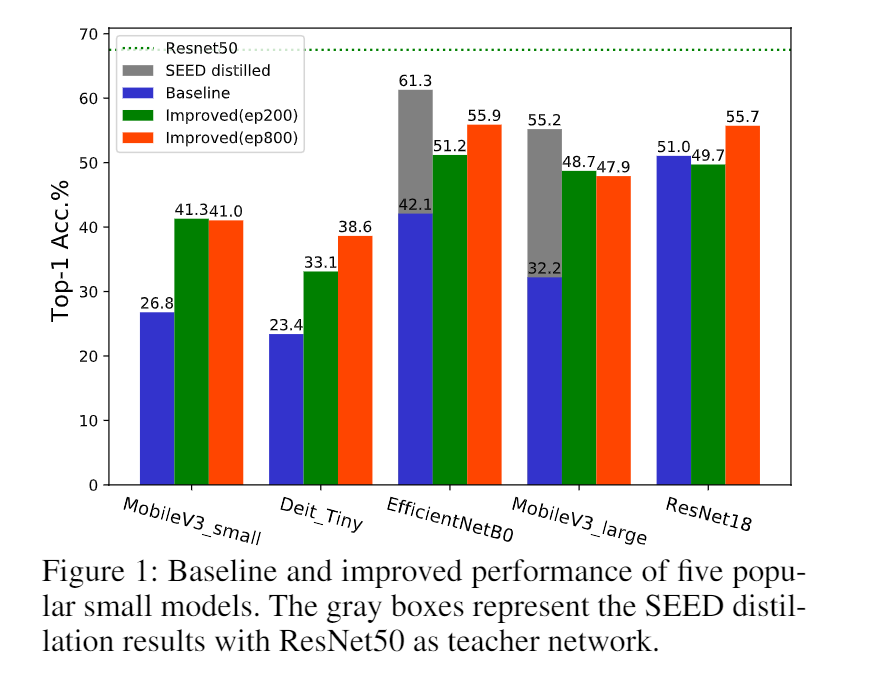

# On the Efficacy of Small Self-Supervised Contrastive Models without Distillation Signals

This is the code base for effectively training the [self-supervised small models](https://arxiv.org/abs/2107.14762):
```
@article{shi2021efficacy,
  title	  = {On the Efficacy of Small Self-Supervised Contrastive Models without Distillation Signals},
  author  = {Shi, Haizhou and Zhang, Youcai and Tang, Siliang and Zhu, Wenjie and Li, Yaqian and Guo, Yandong and Zhuang, Yueting},
  journal = {arXiv preprint arXiv:2107.14762},
  year    = {2021}
}
```

## Credit to the previous work
This work is done with the help of the amazing code base of the self-supervised learning method [MoCo](https://github.com/facebookresearch/moco) and the distillation-based method [SEED](https://github.com/jacobswan1/SEED).

## Overview of the Paper
<p align="center">
  
</p>

[200-ep checkpoints](https://sbox.myoas.com/l/Be8e35efd05dc4ba4) with password: P7At.9.8eMc 

[800-ep checkpoints](https://sbox.myoas.com/l/B484437465575f607) with password: t90G9*bS8Q.O

## Training Improved Baselines for Small Models
For training five improved baselines on 5 small models, we use the same training command, with the only change of the architecture name.
```
python main_moco_final.py <path/to/imagenet/folder> \
    -a <arch-name> --lr 0.06 --batch-size 512 -j 64 --epochs 800 \
    --dist-url 'env://' --multiprocessing-distributed --world-size 1 --rank 0 \
    --mlp wide --moco-t 0.1 --moco-k 65536 \
    --aug-plus --cj 1. --grey-scale 0.5 --gaussian-blur 0.5 --cos \
    --ckpt-dir <path/to/checkpointing/folder> --resume <path/to/SEED-distilled/checkpoint> \
    --restart
```


## Benchmark models with evaluation metrics 
### Static dataset generation
The static dataset will sample the augmented images from the original imagenet data. This will be used for the fast evaluation on the various metrics.
```
python -m experiments.aug-analysis.sample-augs <path/to/imagenet/train-or-val/folder> <path/to/target/folder>
```

### Instance discrimination accuracy
```
python -m eval.instdisc -a <model-arch> -b <batch-size> -j <job-numbers> --pretrained <path/to/pretrained/model> <path/to/static/dataset> -s <samples-per-class> --gpu 0
```

### Alignment, uniformity, and intra-class alignment
```
python -m eval.stats-dist -a <model-arch> -b <batch-size> -j <job-number> --pretrained <path/to/pretrained/model> <path/to/static/dataset>
```

### best-NN
This is NOT a fassi-gpu implementation for the k-NN evaluation. 
```
python -m eval.knn <path/to/imagenet/folder> -a <model-arch> -b <batch-size> -k <max-kNN> -g <number-of-gpus> --pretrained <path/to/pretrained/model>
```

Specifically in the original paper, we set batch size to 1024, gpu number to 8, and max-kNN to 101 for a fast and fair comparison.
```
python -m eval.knn <path/to/imagenet/folder> -a <model-arch> -b 1024 -k 101 -g 8 --pretrained <path/to/pretrained/model>
```

### Linear evaluation accuracy
Please refer to the original MoCo repo for measuring the linear evaluation accuracy.


### License

This project is under the CC-BY-NC 4.0 license. See [LICENSE](LICENSE) for details.

