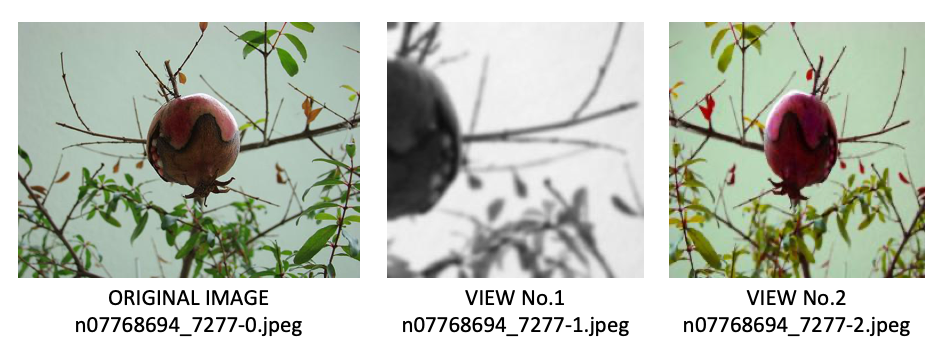

# On the Efficacy of Small Self-Supervised Contrastive Models without Distillation Signals

This is the code base for effectively training the [self-supervised small models](https://arxiv.org/abs/2107.14762):
```
@article{shi2021efficacy,
  title	  = {On the Efficacy of Small Self-Supervised Contrastive Models without Distillation Signals},
  author  = {Shi, Haizhou and Zhang, Youcai and Tang, Siliang and Zhu, Wenjie and Li, Yaqian and Guo, Yandong and Zhuang, Yueting},
  journal = {arXiv preprint arXiv:2107.14762},
  year    = {2021}
}
```

## Credit to the previous work
This work is done with the help of the amazing code base of the self-supervised learning method [MoCo](https://github.com/facebookresearch/moco) and the distillation-based method [SEED](https://github.com/jacobswan1/SEED).

## Overview of the paper
<p align="center">
  
</p>


[200-ep checkpoints](https://sbox.myoas.com/l/Be8e35efd05dc4ba4) with password: P7At.9.8eMc 

[800-ep checkpoints](https://sbox.myoas.com/l/B484437465575f607) with password: t90G9*bS8Q.O

## Training Improved Baselines for Small Models
For training five improved baselines on 5 small models, we use the same training command, with the only change of the architecture name.
```
python main_moco_final.py <path/to/imagenet/folder> \
    -a <arch-name> --lr 0.06 --batch-size 512 -j 64 --epochs 800 \
    --dist-url 'env://' --multiprocessing-distributed --world-size 1 --rank 0 \
    --mlp wide --moco-t 0.1 --moco-k 65536 \
    --aug-plus --cj 1. --grey-scale 0.5 --gaussian-blur 0.5 --cos \
    --ckpt-dir <path/to/checkpointing/folder> --resume <path/to/SEED-distilled/checkpoint> \
    --restart
```

We provide a util function `distill_ckpt2moco_ckpt` to convert the SEED-distilled checkpoints in `util.py`. Feel free to use it after the training SEED for a few epochs. For the details of training SEED, please refer to its original repo.

## Benchmark models with the proposed evaluation metrics 
### Static dataset generation
The static augmented dataset used for benchmarking the performances of different models is generated by sampling the augmented views from the original imagenet data. After running the following command, the original view of the data is indexed as `<image-name>-0.jpeg`, and the two augmented images are named as `<image-name>-1.jpeg` and `<image-name>-2.jpeg`. The whole generation process will take about half an hour since there is no multi-threading used.
```
python -m experiments.sample-augs \
    <path/to/imagenet/train-or-val/folder> \
    <path/to/target/folder> \
    --aug=moco \
    --images-per-class=50
```
Here is an example of the original and augmented views of image yielded:
<p align="center">
  
</p>

### Instance discrimination accuracy
Based on the generated static dataset above, we can evaluate a trained model's pretext instance discrimination task as the following command.
```
python -m eval.instdisc <path/to/static/dataset> \
    -a <model-arch> -b <batch-size> -j <job-numbers> \
    --pretrained <path/to/pretrained/model> \
    -s <samples-per-class> --gpu <gpu-number> \
    --topk <topk-accuracy> --mode <d-sd>
```
where `topk` indicates the Acc@topk; `mode` denotes how we evaluate the instance discrimination as a retrieval task: (i) if you set `mode` as `d-sd`, which represents "d(omain)-s(hifted) d(omain)", and is also the default setting in the paper, then the task will use the original image to retrieve the augmented image; (ii) if you set `mode` as `sd-sd`, then the task will use the augmented image No.1 to retrieve the augmented image No.2.

Running the command on an improved mobilenetv3\_small model (800ep) will typically give you the following output:
```
=> creating model 'mobilenetv3_large'
=> loading checkpoint 'mob-l_800.pth.tar'
=> loaded pre-trained model 'mob-l_800.pth.tar'
=> iterating through the dataset...
100%|███████████████████████████████████████████████████| 391/391 [01:09<00:00,  5.59it/s]
=> iterating through the representations...
100%|████████████████████████████████████████████████| 1000/1000 [00:02<00:00, 435.72it/s]
Masked: normal; Mode: d-sd; Top1-5: [93.532, 95.462, 96.224, 96.65, 96.978]; CKPT: mob-l_800.pth.tar; Dataset: auged-imagenet/train
```

### Alignment, uniformity, and intra-class alignment
This command will give you the statistics of alignment, uniformity, and intra-class alignment, in terms of both the original domain and the shifted domain (which means the augmented images).
```
python -m eval.stats-dist <path/to/static/dataset> \
    -a <model-arch> -b <batch-size> -j <job-number> \
    --pretrained <path/to/pretrained/model> \
    -s <samples-per-class> --gpu <gpu-number>
```

A typical output of this command is shown as follows:
```
=> creating model 'mobilenetv3_large'
=> loading checkpoint 'mob-l_800.pth.tar'
=> loaded pre-trained model 'mob-l_800.pth.tar'
=> iterating through the dataset...
100%|███████████████████████████████████████████████████| 391/391 [01:09<00:00,  5.63it/s]
=> calculating instance-level alignment...
=> calculating class-level alignment...
=> calculating instance-level uniformity...
mob-l_800.pth.tar,auged-imagenet/train
D-SD align     SD-SD align    D cls-align    SD cls-align   D uniform      SD uniform
0.2273         0.2858         1.2955         1.3025         -3.4162        -3.3200
```

### Best-NN
This is NOT a fassi-gpu implementation for the k-NN evaluation, instead we utilize the multiple GPUs to obtain the accurate k-NN results.
```
python -m eval.knn <path/to/imagenet/folder> \
    -a <model-arch> -b <batch-size> -k <max-kNN> -g <number-of-gpus> \
    --pretrained <path/to/pretrained/model> \
    --rep-space <rep-space-type>
```
where `rep-space` denotes how the representation should be leveraged to perform k-NN evaluation. By default we use the `original` representations yielded by the encoder network, whereas we provide two additional operations: (i) `norm`: which normalizes the representations to a unit-sphere before calculating the distance; (ii) `shifted-norm`: which subtracts the batch mean of the representations before normalization. 

Specifically in the original paper, we set batch size to 1024, gpu number to 8, and max-kNN to 101 for a fast and fair evaluation. It normally takes 10-15 minutes to complete the evaluation.


## Linear evaluation and transfer learning
### Linear evaluation
Please refer to the original MoCo repo for measuring the linear evaluation accuracy. We use the same set of hyper-parameters for measuring the linear evaluation accuracy as in MoCo.

### Transfer learning
We benchmark the linear separability of the encoder network on the datasets of other domains. Three datasets are used: CIFAR10, CIFAR100, and Caltech101. We brute-forcely specify the data augmentation during the transfer learning training. The command can be found as follows: 
```
python main_transfer.py <path/to/imagenet/folder>\
  -a <model-arch> \
  --lr <learning-rate> \
  --batch-size <batch-size> \
  --pretrained <path/to/pretrained/model> \
  --dist-url 'tcp://localhost:10001' --multiprocessing-distributed --world-size 1 --rank 0 \
  --dataset <dataset-name> \
  (--finetune)
```
where `dataset` can be `cifar10`, `cifar100`, or `caltech101`. Additionally, you can set `--finetune` flag to enable the backbone updating during transfer learning.


## Visualizing the representation space of the pretrained models
We provide several helper functions in `experiments/tsne.py` for visualizing the representation space of the given model. The details are spared.


## License
This project is under the CC-BY-NC 4.0 license. See [LICENSE](LICENSE) for details.

